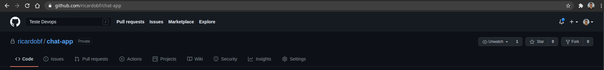

# Chat App

[](https://github.com/ricardobf/chat-app/blob/production/LICENSE)
[](https://github.com/ricardobf/chat-app/issues)
[](https://github.com/ricardobf/chat-app/stargazers)

This repository uses Go (Backend), React (Frontend) and Redis (Messages storage) to deploy a simple chat-app application.
There is two frontend docker images (`Dockerfile.development` and `Dockerfile.production`), the first one is used by docker-compose for development environment and the other one is used by Circle CI for production environment.

The production (backend) docker file is available on [DockerHub - ricardob/chat-app-backend](https://hub.docker.com/r/ricardob/chat-app-backend)

The production (frontend) docker file is available on [DockerHub - ricardob/chat-app-frontend](https://hub.docker.com/r/ricardob/chat-app-frontend)

**Table of Contents**

1. [Requirements](#requirements)
1. [Installation](#installation)
1. [License](#license)

## Requirements

- Git;
- Go; (for development installation)
- Docker; (for development installation)
- Docker Compose; (for development installation)
- nodejs, npm; (for development installation)
- Circle CI account; (for production deployment)

## Development Installation

### Install and run the application locally:

Using Docker Compose:

1. Clone the repository

With SSH
```shell
# git clone git@github.com:ricardobf/chat-app.git
```
or with HTTPS
```shell
# git clone https://github.com/ricardobf/chat-app.git
```

2. Navigate to application folder:
```shell
# cd chat-app
```

3. Run `docker-compose` command:
```shell
# docker-compose up
```

4. On your browser navigate to [localhost:3000](http://localhost:3000)

Obs.: You can change environment varibles inside `docker-compose.yml` file.

## Production Installation

### Running on Circle CI and GitHub

1. Navigate to [github.com/ricardobf/chat-app](https://www.github.com/ricardobf/chat-app) and fork the repository to your own workspace:


2. On another tab, navigate to [circleci.com](https://www.circleci.com) and create or login to an existing Circle CI account using GitHub:


3. On Projects tab, choose the right repository application:


4. On project settings, create environment variables according to your DockerHub account and image name:


4. Wait for the pipeline to run.


## License

See [LICENSE](https://github.com/ricardobf/chat-app/LICENSE).